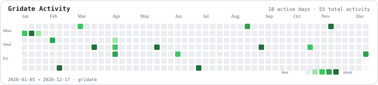

# Gridate

## About

Visual Activity Timeline Planner for browser-based activity datasets.

[**ecd5a.github.io/Gridate/**](https://ecd5a.github.io/Gridate/)

  
  
  
  
  

Gridate is a local-first visual planner for painting date-based activity, shaping contribution-style calendars, and exporting a structured timeline.

## Features

- GitHub-style contribution calendars for any date range
- Left-click add and right-click subtract by default
- Drag painting, event times, targets, history, undo and redo
- TXT and JSON exports with RU/EN interface and Light/Dark themes
- No account, backend, analytics, or repository access

## GitHub Action

The same repository includes **Gridate Activity Calendar Generator** for GitHub Actions. It turns JSON or CSV activity data into accessible light and dark SVG calendars for profile READMEs, project pages, release notes, and documentation.

  <picture>
    <source media="(prefers-color-scheme: dark)" srcset="./action-preview/gridate-dark.svg">
    <source media="(prefers-color-scheme: light)" srcset="./action-preview/gridate.svg">
    
  </picture>

[Use Gridate Activity Calendar Generator in GitHub Marketplace](https://github.com/marketplace/actions/gridate-activity-calendar-generator)

## Privacy

Gridate runs locally in the browser. Timeline data stays in local storage, and the Action does not request external activity data or require an API token.

## Support

If Gridate is useful to your work, support its continued maintenance:

- TON: `pointoncurve.ton`
- Bitcoin (BTC): `1ECDSA1b4d5TcZHtqNpcxmY8pBH1GgHntN`
- USDT (TRC20): `TUF4vPdB6QkjCvZq18rBL4Qj4dK5ihCN75`

## Contact

  
  &nbsp;
  
  &nbsp;
  <a href="https://github.com/ECD5A/Tkach-Security" aria-label="GitHub repository"><picture><source media="(prefers-color-scheme: dark)" srcset="https://cdn.simpleicons.org/github/FFFFFF"></picture></a>

