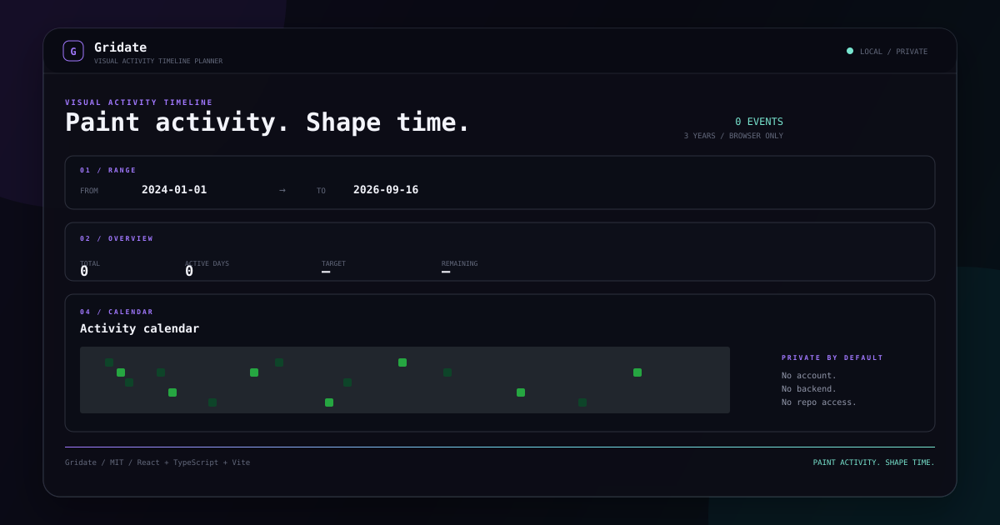

# Gridate

Visual Activity Timeline Planner.

Gridate is a small browser tool for painting date-based activity patterns, assigning events to days, and exporting a structured chronological history.



## Features

- Contribution-style calendar for any date range
- Three-year starting range based on the current calendar year
- Left-click add / right-click subtract by default, with a reversible mouse mode
- Drag painting with one update per visited cell
- Exact day counts from 0 to 99
- Manual event times and random time generation
- Target tracking, totals, active days, yearly breakdown and remaining count
- Readable and technical history views
- Copy, TXT export and JSON export
- Undo, redo and clear confirmation
- RU/EN language switch and Light/Dark themes
- Browser-only persistence through versioned `localStorage`
- No account, backend, analytics or repository access

## Getting Started

Requirements: Node.js 20+ and npm.

```bash
npm install
npm run dev
```

Open the local Vite URL shown in the terminal.

## Production Build

```bash
npm run typecheck
npm run test:run
npm run build
npm run preview
```

The generated `dist/` directory is ready for static hosting on GitHub Pages, Vercel, Netlify or any equivalent host.

## Data and Privacy

Gridate is intentionally local-first:

- no account;
- no backend;
- no analytics by default;
- no GitHub, GitLab or repository access;
- no network request is needed for the planner;
- timeline data stays in the browser's local storage.

## Tech Stack

React, TypeScript, Vite, native CSS, Vitest and React Testing Library-compatible DOM tests.

The project follows a CSS-first, dependency-light UI policy. The contribution calendar is a native Gridate component rather than a copy of a third-party component collection.

## License

Gridate is released under the [MIT License](LICENSE).
